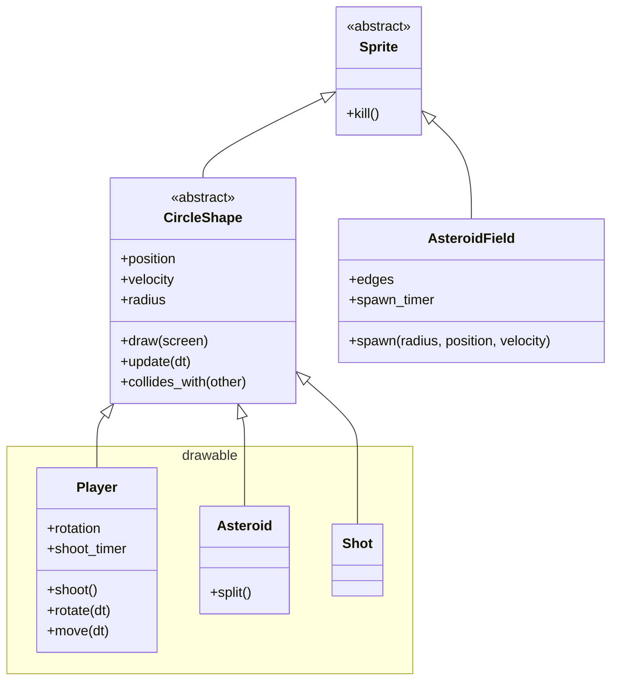

```mermaid
classDiagram
    class Sprite {
        <<abstract>>
        +kill()
    }

    class CircleShape {
        <<abstract>>
        +position
        +velocity
        +radius
        +draw(screen)
        +update(dt)
        +collides_with(other)
    }

    namespace drawable {
    class Player {
        +rotation
        +shoot_timer
        +shoot()
        +rotate(dt)
        +move(dt)
    }

    class Asteroid {
        +split()
    }

    class Shot
    }
    class AsteroidField {
        +edges
        +spawn_timer
        +spawn(radius, position, velocity)
    }

    Sprite <|-- AsteroidField
    Sprite <|-- CircleShape
    CircleShape <|-- Player
    CircleShape <|-- Asteroid
    CircleShape <|-- Shot
```
